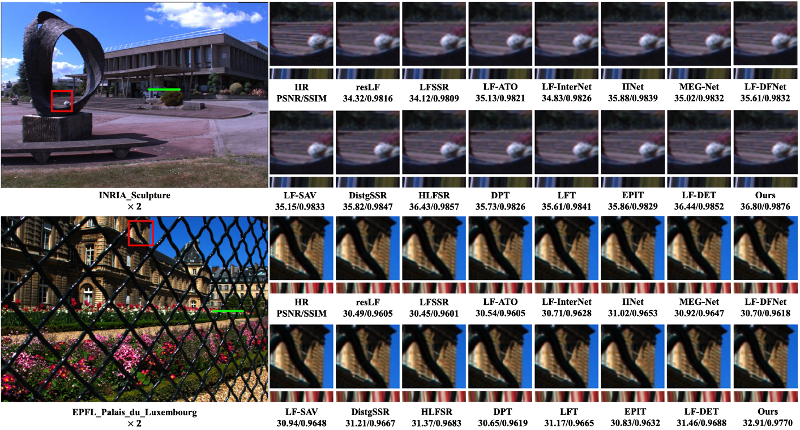
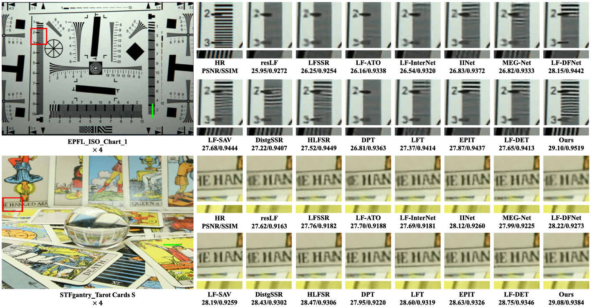

# Learning Domain-Agnostic Spatial-Angular Feature for Light Field Image Super-Resolution


<div align="center">
[Wang Xia](https://github.com/stanley-313) · Yao Lu · [Shunzhou Wang](https://scholar.google.com/citations?hl=zh-CN&user=XVAhrT4AAAAJ) · Linwen Xu
<br>
<a href='https://www.sciencedirect.com/science/article/pii/S0031320326003006?dgcid=coauthor'></a>
</div>


Extracting spatial-angular features from light fields (LF) subspaces (i.e., sub-aperture images (SAI), macro-pixel  images (MacPI), and epipolar plane images (EPI)) is a common practice in Light Field Image Super-Resolution  (LFSR). While this approach effectively captures domain-specific properties of LFs, existing methods often fail  to fully integrate these distinguished domain-specific characteristics into a single feature map due to the under exploitation of domain-specific features, or simple feature fusion strategies, leading to suboptimal results. In this  work, we propose a novel framework to extract domain-agnostic spatial-angular features that simultaneously  preserve diverse domain-specific properties. We first introduce a Detail-Aware Transformer Layer (DATL), serv ing as a general feature extraction module that excels in preserving intricate details. Applying DATLs on different  subspaces, we propose a Domain-Agnostic Feature Extraction Block (DAFEB) to extract domain-agnostic spatial angular features through our meticulously designed feature processing approach. First, spatial information is  extracted on SAI and MacPI domains sequentially. Next, angular consistency is enhanced on EPI domain. Ob serving that the spatial details are weakened due to this direct domain transition. We propose a novel discrepancy  extraction and re-enhancement mechanism to address this issue. Specifically, we extract the discrepancy features  of the last two steps to retain the angular consistency property and then re-enhance the features’ spatial details,  the resultant feature then adds to the initial feature to finally obtain domain-agnostic features with enhanced  spatial details and preserved angular consistency. Extensive experiments on LF benchmarks demonstrate that our  method LF-DANet achieves state-of-the-art performance with competitive efficiency.


## Preparation:
***

1. **Requirement:**
   - pytorch = 1.12.1, torchvision = 0.13.1, python = 3.8
2. **Datasets:**
   - We use five LF benchmarks in [BasicLFSR](https://github.com/ZhengyuLiang24/BasicLFSR)
   (i.e., EPFL, HCInew, HCIold, INRIA, and STFgantry). Download and put them in folder `./datasets/`.
3. **Generate training and testing data:**
   - Run `Generate_Data_for_Training.py` to generate training data in `./data_for_training/`.
   - Run `Generate_Data_for_Test.py` to generate testing data in `./data_for_test/`.
   
## Train:
***
- Set the hyper\-parameters in `parse_args()` in `train.py` if needed.
- Run `train.py` to train network
- Checkpoints will be saved in `./log/`

## Test:
***
- Run `test.py` to perform test on each dataset. The resultant `.mat` files will be saved in `./Results/`
- Run `GenerateResultImages.py` to generate SR RGB images. Saved in `./SRimage/` 
### Results:
***
#### Quantitative results:


#### Visual comparisons:




### Citation

If you find LF-DANet useful in your research or projects, please cite our work:

``````
@article{xia2026learning,
  title={Learning Domain-Agnostic Spatial-Angular Feature for Light Field Image Super-Resolution},
  author={Xia, Wang and Lu, Yao and Wang, Shunzhou and Xu, Lingwen},
  journal={Pattern Recognition},
  pages={113335},
  year={2026},
  publisher={Elsevier}
}
``````

