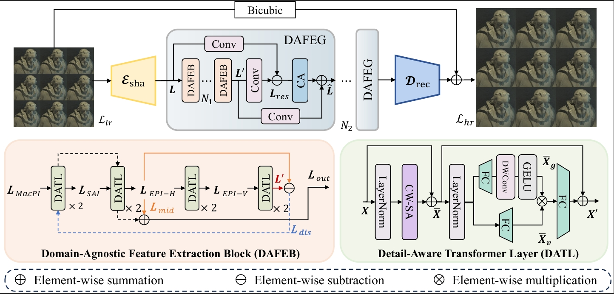
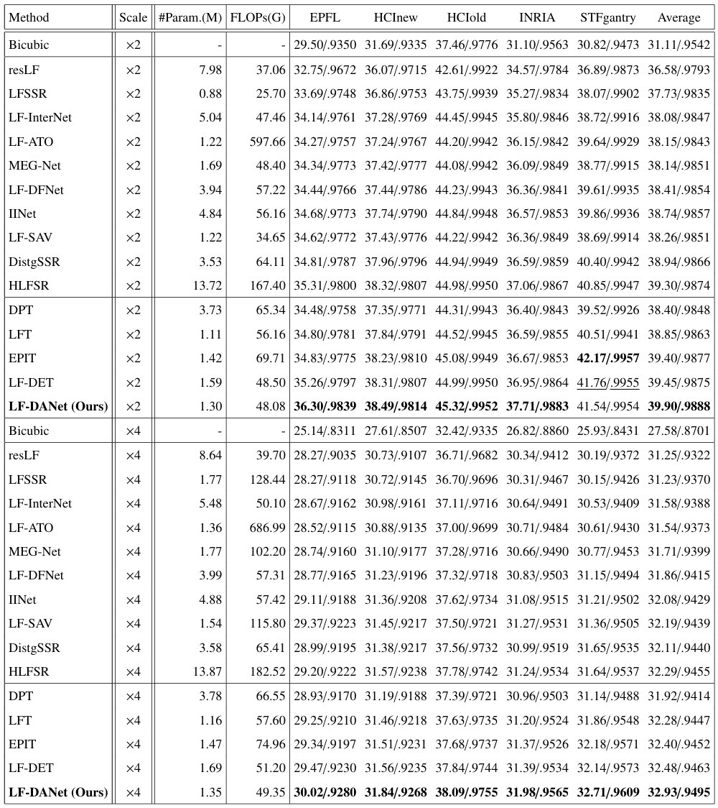
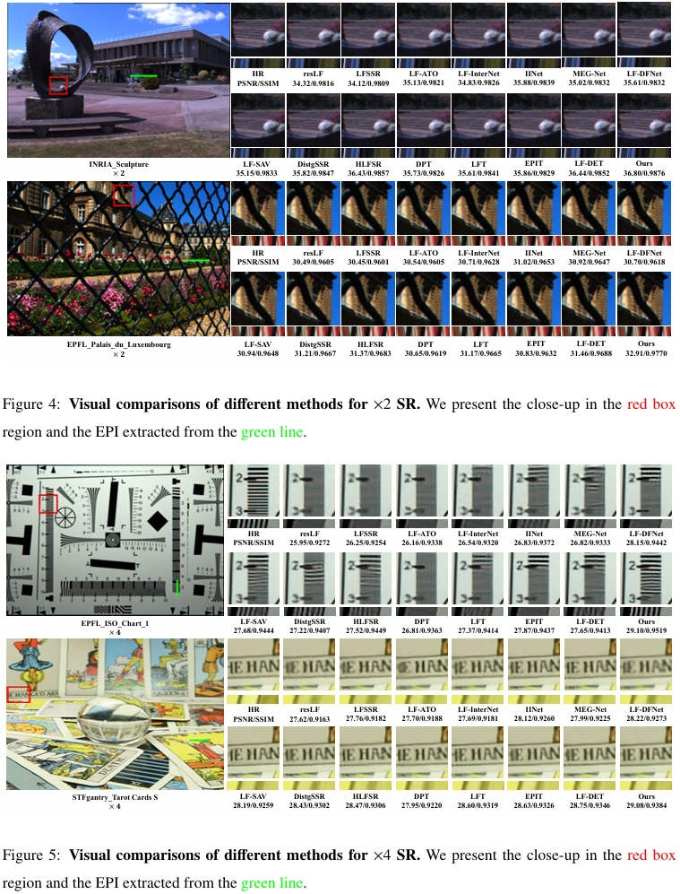

# Learning Domain-Agnostic Spatial-Angular Feature for Light Field Image Super-Resolution
***

## Preparation:
***

1. **Requirement:**
   - pytorch = 1.12.1, torchvision = 0.13.1, python = 3.8
2. **Datasets:**
   - We use five LF benchmarks in [BasicLFSR](https://github.com/ZhengyuLiang24/BasicLFSR)
   (i.e., EPFL, HCInew, HCIold, INRIA, and STFgantry). Download and put them in folder `./datasets/`.
3. **Generate training and testing data:**
   - Run `Generate_Data_for_Training.py` to generate training data in `./data_for_training/`.
   - Run `Generate_Data_for_Test.py` to generate testing data in `./data_for_test/`.
   
## Train:
***
- Set the hyper\-parameters in `parse_args()` in `train.py` if needed.
- Run `train.py` to train network
- Checkpoints will be saved in `./log/`

## Test:
***
- Run `test.py` to perform test on each dataset. The resultant `.mat` files will be saved in `./Results/`
- Run `GenerateResultImages.py` to generate SR RGB images. Saved in `./SRimage/` 
### Results:
***
#### Quantitative results:

#### Visual comparisons:

